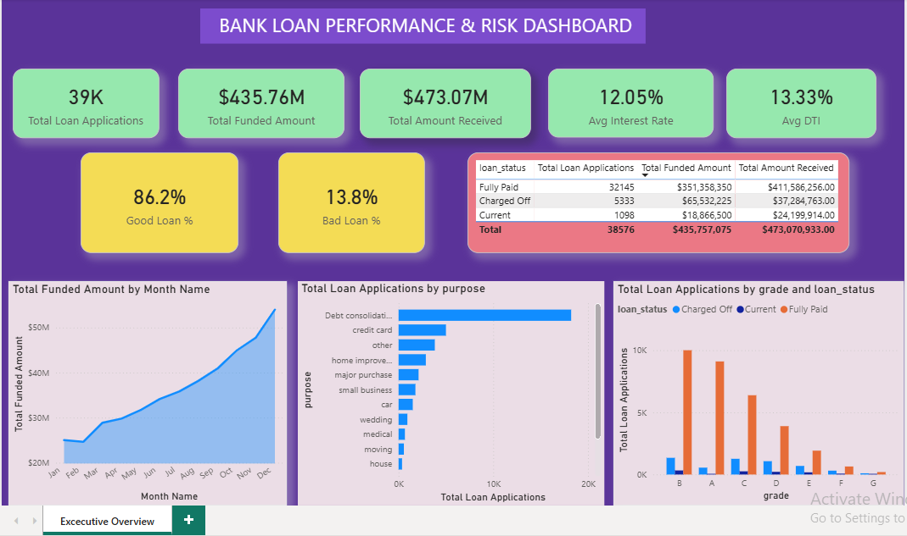

# Bank Loan Performance & Credit Risk Analysis

An end-to-end financial analytics project evaluating retail loan performance, repayment health, and default risk factors across **38,576 borrower applications** totaling **$435.76M in funded capital**. 



This project combines exploratory querying and data auditing in **SQL** with dynamic star-schema modeling, DAX time-intelligence, and interactive reporting in **Power BI**.

---

## 📌 Executive Summary & Key Metrics

| Metric | Value | Business Description |
| :--- | :--- | :--- |
| **Total Loan Applications** | **38,576** | Total credit requests processed |
| **Total Funded Amount** | **$435.76M** | Aggregate principal capital disbursed to borrowers |
| **Total Amount Received** | **$473.07M** | Total cash inflows (principal + interest/fees collected) |
| **Average Interest Rate** | **12.05%** | Portfolio-wide weighted average borrowing rate |
| **Average Debt-to-Income (DTI)** | **13.33%** | Mean borrower debt obligations relative to gross income |
| **Good Loan Rate** | **86.18%** | 33,243 applications (`Fully Paid` & `Current`) |
| **Bad Loan Rate (Default)** | **13.82%** | 5,333 charged-off applications |

---

## 🔍 Key Business Insights

1. **Net Positive Cash Flow Despite Defaults:**
   * Total capital recovered ($473.07M) exceeded total funded capital ($435.76M) by **+$37.31M**, demonstrating that aggregate interest income from performing loans sufficiently offset credit losses.
   * **Good Loans** generated **$435.79M** against **$370.22M** funded (+$65.56M gross surplus).
   * **Bad Loans** accounted for **$65.53M** funded, with only **$37.28M** recovered, resulting in a **$28.25M net capital write-off**.

2. **Credit Grade Risk Escalation:**
   * Default rates scale steeply across loan tiers:
     * **Grade A:** 5.70% default rate (Prime borrowers)
     * **Grade B / C:** 11.50% / 16.02% default rate
     * **Grade D / E:** 20.69% / 24.80% default rate
     * **Grade F / G:** 30.25% / 31.31% default rate (Subprime risk)
   * The subprime tiers (E, F, G) require tighter debt-to-income caps and stricter automated collateral verification rules.

3. **Loan Purpose Concentration:**
   * **Debt Consolidation** represents the single largest driver of loan demand (**18,214 applications / 47.2%**), followed by **Credit Card refinancing** (**4,998 applications / 13.0%**).
   * High concentration in debt-refinancing highlights macro credit sensitivity—borrowers utilizing debt consolidation carry elevated vulnerability to interest rate shifts.

---

## 🛠️️ Data Architecture & Tech Stack

* **SQL (Data Auditing & Validation Layer):** Validated aggregate figures, evaluated loan status distributions, and formulated Month-over-Month (MoM) growth benchmarks using Common Table Expressions (CTEs), conditional aggregations (`CASE WHEN`), and window functions (`LAG`).
* **Power Query (ETL & Shaping):** Resolved locale date transformations (`DD-MM-YYYY`), standardized numeric percentages, and classified loan categories.
* **Power BI & DAX (Modeling & Visualization):** Constructed a star schema with a dedicated calendar dimension table (`Dim_Date`) and implemented clean DAX measures for executive summary reporting.

---

## 💻 SQL Query Highlights

### 1. Good vs. Bad Loan Portfolio Breakdown
```sql
SELECT
    CASE 
        WHEN loan_status IN ('Fully Paid', 'Current') THEN 'Good Loan'
        WHEN loan_status = 'Charged Off' THEN 'Bad Loan'
    END AS Loan_Category,
    COUNT(id) AS Total_Applications,
    ROUND(COUNT(id) * 100.0 / (SELECT COUNT(*) FROM bank_loan_data), 2) AS Allocation_Pct,
    SUM(loan_amount) AS Total_Funded_Amount,
    SUM(total_payment) AS Total_Received_Amount,
    ROUND(SUM(total_payment) - SUM(loan_amount), 2) AS Net_Cash_Flow
FROM bank_loan_data
GROUP BY 
    CASE 
        WHEN loan_status IN ('Fully Paid', 'Current') THEN 'Good Loan'
        WHEN loan_status = 'Charged Off' THEN 'Bad Loan'
    END;# Bank-Loan-Performance-Analysis

WITH MonthlySummary AS (
    SELECT 
        CAST(SUBSTR(issue_date, 4, 2) AS INTEGER) AS Month_No,
        COUNT(id) AS Monthly_Applications,
        SUM(loan_amount) AS Monthly_Funded_Amount
    FROM bank_loan_data
    GROUP BY CAST(SUBSTR(issue_date, 4, 2) AS INTEGER)
)
SELECT 
    Month_No,
    Monthly_Applications,
    Monthly_Funded_Amount,
    LAG(Monthly_Applications) OVER (ORDER BY Month_No) AS Prev_Month_Applications,
    ROUND(
        (Monthly_Applications - LAG(Monthly_Applications) OVER (ORDER BY Month_No)) * 100.0 / 
        LAG(Monthly_Applications) OVER (ORDER BY Month_No), 2
    ) AS MoM_Application_Growth_Pct
FROM MonthlySummary
ORDER BY Month_No;
```
```markdown
** Project Structure**
```text
├── data/
│   └── financial_loan.csv               # Raw loan dataset (38,576 rows)
├── sql/
│   └── bank_loan_analysis.sql           # SQL audit, KPI, and MoM scripts
├── dashboard/
│   └── Bank_Loan_Dashboard.pbix        # Interactive Power BI report file
├── screenshots/
│   └── executive_summary.png           # Power BI dashboard preview
└── README.md                            # Project documentation
